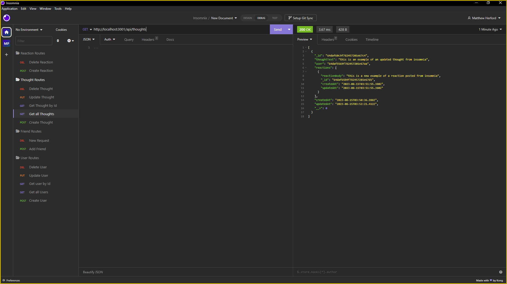

# social-network-api
This weeks challenge was to create a simple api backend for a social mediea site using Mongo db

## Requirements
the requirements to complete the assingment were to create a working api that could add and remove friends, make posts with users names attatched, and have the ability to leave reactions to the posts

## Screenshots and videos

https://youtu.be/wgMJZ1ejXA8

## Github links
https://github.com/shyguyMatt/social-network-api